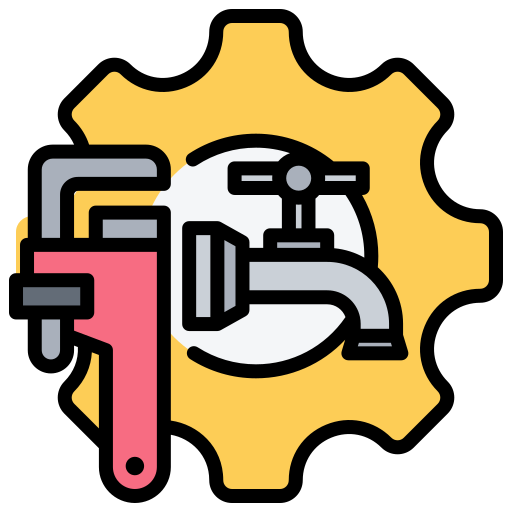

<h1>
  
    Pipeline
</h1>

A minimal RESTful API suite that lets you set up and manage a simple CI/CD pipeline
configuration.

## Assumptions

1. The `pipeline` service primarily handles scheduling stages but doesn't manage their
   execution directly. There's a separate runner module in the `src` directory that acts as
   the task runner. While the pipeline service could use RPC to call the runner, here it
   delegates the execution of stages to the `runner.run_pipeline` function.

2. The service supports both sequential and parallel scheduling of stages. However, it
   doesn’t handle resolving a DAG (Directed Acyclic Graph) for dependent stages. All stages
   are either scheduled to run sequentially or in parallel.

3. When scheduling sequentially, stages are executed in the order they appear in the input
   (e.g., `Run`, `Build`, `Deploy`). For parallel scheduling, the order is irrelevant.

4. By default, stages are scheduled sequentially. If you pass `parallel: true` during
   pipeline creation, the stages will run in parallel.

5. If a pipeline fails, the entire pipeline must be retried. The service does not support
   retrying individual stages.

6. Each stage within a pipeline configuration must have a unique name. If there are
   duplicate names, a validation error will be raised.

7. The pipeline configuration is stored in a concurrency-safe data structure, ensuring that
   concurrent service calls don’t cause data corruption.

## Architecture

Here's a high-level overview of the service's architecture:

![Architecture diagram][arch-diagram]

-   `POST /pipelines` creates a new pipeline from a JSON configuration, validates the data,
    and stores the pipeline in the database.

-   `GET /pipelines/{id}` retrieves a pipeline by its ID after verifying its existence in
    the database.

-   `PUT /pipelines/{id}` updates an existing pipeline configuration, validates the new
    data, and stores the updates in the database.

-   `DELETE /pipelines/{id}` deletes a pipeline by its ID after confirming its existence.

-   `POST /pipelines/{id}/trigger` triggers the pipeline’s stages, which run sequentially or
    in parallel depending on the `parallel` parameter set during creation.

The service is written in [Python 3.13], uses [FastAPI] for the API, and [uv] for managing dependencies.

## Prerequisites

-   Install [Docker] to quickly spin up the service.
-   To run tests or use the CLI, make sure you have the following installed locally:
    -   [Python 3.13]
    -   [uv]
-   Install [jq] for pretty-printing JSON API responses.

## Run the service

### In a container

From the root directory, run:

```sh
make run-container
```

This spins up the service in a container, exposing it at `http://localhost:5001`.

### Or, locally

With Python 3.13 and `uv` installed locally, run the following from the root directory:

```sh
make run-local
```

This sets up a Python 3.13 virtual environment, installs dependencies, and starts a
[uvicorn] server running the application.

## Explore the endpoints

### Via cURL

We'll use `cURL` to interact with the endpoints. The service runs locally on port `5001`.

#### Create a pipeline

To create a pipeline configuration, use the `POST /pipelines` endpoint:

```sh
curl -X 'POST' \
  'http://0.0.0.0:5001/v1/pipelines' \
  -H 'accept: application/json' \
  -H 'Authorization: Basic YWRtaW46YWRtaW4=' \
  -H 'Content-Type: application/json' \
  -d '{
  "git_repository": "https://github.com/example/repo",
  "name": "CI Pipeline",
  "parallel": false,
  "stages": [
    {
      "command": "pytest",
      "name": "Run tests",
      "timeout": 500,
      "type": "Run"
    },
    {
      "dockerfile": "FROM alpine:latest && CMD [\"echo\", \"Hello, World!\"]",
      "ecr_repository": "123456789012.dkr.ecr.us-east-1.amazonaws.com/my-repo",
      "name": "Build Docker image",
      "tag": "latest",
      "type": "Build"
    },
    {
      "cluster": {
        "name": "my-cluster",
        "namespace": "production",
        "server_url": "https://my-cluster.example.com"
      },
      "k8s_manifest": {
        "apiVersion": "apps/v1",
        "kind": "Deployment",
        "metadata": {
          "name": "my-app"
        },
        "spec": {
          "replicas": 2,
          "selector": {
            "matchLabels": {
              "app": "my-app"
            }
          },
          "template": {
            "metadata": {
              "labels": {
                "app": "my-app"
              }
            },
            "spec": {
              "containers": [
                {
                  "image": "my-app-image:v1.0.0",
                  "name": "my-app-container",
                  "ports": [
                    {
                      "containerPort": 80
                    }
                  ]
                }
              ]
            }
          }
        }
      },
      "name": "deploy-app-stage",
      "type": "Deploy"
    }
  ]
}' | jq
```

This request uses HTTP basic authentication (`admin` as both the username and password), and
the base64-encoded authorization header is included. The output will include the ID of the
newly created pipeline.

#### Get a pipeline

To retrieve a pipeline configuration, pass its ID to the `GET /pipelines/{id}` endpoint:

```sh
curl -X 'GET' \
  'http://0.0.0.0:5001/v1/pipelines/078ba92d-63fc-4106-b9da-ac2fc6f2cec5' \
  -H 'accept: application/json' \
  -H 'Authorization: Basic YWRtaW46YWRtaW4=' | jq
```

The output will display the stored configuration:

```json
{
  "name": "CI Pipeline",
  "git_repository": "https://github.com/example/repo",
  "stages": [
    {
      "name": "Run tests",
      "type": "Run",
      "command": "pytest",
      "timeout": 500
    },
    {
      "name": "Build Docker image",
      "type": "Build",
      "dockerfile": "FROM alpine:latest && CMD [\"echo\", \"Hello, World!\"]",
      "ecr_repository": "123456789012.dkr.ecr.us-east-1.amazonaws.com/my-repo",
      "tag": "latest"
    },
    {
      "name": "deploy-app-stage",
      "type": "Deploy",
      "cluster": {
        "name": "my-cluster",
        "namespace": "production",
        "server_url": "https://my-cluster.example.com"
      },
      "k8s_manifest": {
        "apiVersion": "apps/v1",
        "kind": "Deployment",
        "metadata": {
          "name": "my-app"
        },
        "spec": {
          "replicas": 2,
          "selector": {
            "matchLabels": {
              "app": "my-app"
            }
          },
          "template": {
            "metadata": {
              "labels": {
                "app": "my-app"
              }
            },
            "spec": {
              "containers": [
                {
                  "image": "my-app-image:v1.0.0",
                  "name": "my-app-container",
                  "ports": [
                    {
                      "containerPort": 80
                    }
                  ]
                }
              ]
            }
          }
        }
      }
    }
  ],
  "parallel": false,
  "id": "078ba92d-63fc-4106-b9da-ac2fc6f2cec5"
}
```

#### Update a pipeline

To update the pipeline configuration, use its ID and send the updated data:

```sh
curl -X 'PUT' \
  'http://0.0.0.0:5001/v1/pipelines/078ba92d-63fc-4106-b9da-ac2fc6f2cec5' \
  -H 'accept: application/json' \
  -H 'Authorization: Basic YWRtaW46YWRtaW4=' \
  -H 'Content-Type: application/json' \
  -d '{
  "git_repository": "https://github.com/example/repo",
  "name": "CI Pipeline",
  "parallel": true,
  "stages": [
    {
      "command": "pytest",
      "name": "Run tests",
      "timeout": 500,
      "type": "Run"
    }
  ]
}' | jq
```

This modifies the pipeline configuration, removing all but the `Run` stage:

```json
{
  "id": "078ba92d-63fc-4106-b9da-ac2fc6f2cec5",
  "message": "Pipeline updated successfully."
}
```

#### Trigger a pipeline

To trigger a pipeline, use the following command:

```sh
curl -X 'POST' \
  'http://0.0.0.0:5001/v1/pipelines/078ba92d-63fc-4106-b9da-ac2fc6f2cec5/trigger' \
  -H 'accept: application/json' \
  -H 'Authorization: Basic YWRtaW46YWRtaW4=' \
  -d '' | jq
```

The pipeline will be triggered in the background, and you'll receive this response:

```json
{
  "id": "078ba92d-63fc-4106-b9da-ac2fc6f2cec5",
  "message": "Pipeline triggered successfully."
}
```

#### Delete a pipeline

To delete a pipeline, use the following request:

```sh
curl -X 'DELETE' \
  'http://0.0.0.0:5001/v1/pipelines/078ba92d-63fc-4106-b9da-ac2fc6f2cec5' \
  -H 'accept: application/json' \
  -H 'Authorization: Basic YWRtaW46YWRtaW4=' \
  -d '' | jq
```

This will delete the pipeline and return:

```json
{
  "id": "078ba92d-63fc-4106-b9da-ac2fc6f2cec5",
  "message": "Pipeline deleted successfully."
}
```

### Via interactive OpenAPI docs

You can also interact with the service via its interactive OpenAPI documentation. Once the
service is running, head to [http://localhost:5001/docs][docs]. Here's what it looks like:

![FastAPI docs page 1][docs-1]

You can use the interactive interface to make requests and view the results. For example,
you can create a pipeline like this:

![FastAPI docs create pipeline][docs-2]

Clicking the **Execute** button will ask for your credentials. Just use `admin` for both the
username and password. Once that’s done, you can see that the request succeeded.

![FastAPI docs create pipeline response][docs-3]

You can explore the other endpoints in a similar fashion.

### Log inspection and pipeline cancellation behavior

When a pipeline is triggered, logs associated with the runner are printed. Here's how the
log stream looks for a sequential stage run (timestamps omitted for brevity):

```txt
pipeline.runner - INFO - Running pipeline '6e3af0f0-3f30-4fcb-8960-eeeafb663374' stages in sequence.
pipeline.runner - INFO - Running stage 'Run tests' type 'run'.
pipeline.runner - INFO - Stage 'Run tests' completed.
pipeline.runner - INFO - Running stage 'Build Docker image' of type 'build'.
pipeline.runner - INFO - Building the application...
pipeline.runner - INFO - Uploading to ecr...
pipeline.runner - INFO - Stage 'Build Docker image' completed.
pipeline.runner - INFO - Running stage 'deploy-app-stage' of type 'deploy'.
pipeline.runner - INFO - Deploying the application to k8s...
pipeline.runner - INFO - Stage 'deploy-app-stage' completed.
pipeline.runner - INFO - Pipeline '6e3af0f0-3f30-4fcb-8960-eeeafb663374' stages completed successfully.
pipeline.runner - INFO - Pipeline '6e3af0f0-3f30-4fcb-8960-eeeafb663374' completed successfully.
```

For parallel stage execution, the logs will look something like this:

```txt
pipeline.runner - INFO - Running stage 'Run tests' type 'run'.
pipeline.runner - INFO - Running stage 'Build Docker image' of type 'build'.
pipeline.runner - INFO - Building the application...
pipeline.runner - INFO - Uploading to ecr...
pipeline.runner - INFO - Running stage 'deploy-app-stage' of type 'deploy'.
pipeline.runner - INFO - Deploying the application to k8s...
pipeline.runner - INFO - Stage 'Run tests' completed.
pipeline.runner - INFO - Stage 'Build Docker image' completed.
pipeline.runner - INFO - Stage 'deploy-app-stage' completed.
pipeline.runner - INFO - Pipeline '262953b3-3821-48b7-a1c8-f94e17763f38' completed successfully.
```

Observe that, in parallel execution, tasks are fired off and completed in an arbitrary
order.

If you try to retrigger a pipeline multiple times before all stages finish, the runner will
cancel the previous run before executing a new one. Here’s what it looks like:

```txt
pipeline.runner - INFO - Running pipeline '9fad63f4-2662-4bdd-b09d-e3817c0b730a' stages in sequence.
pipeline.runner - INFO - Running stage 'Run tests' type 'run'.
pipeline.handlers - INFO - Scheduling pipeline stages...
pipeline.runner - INFO - Pipeline '9fad63f4-2662-4bdd-b09d-e3817c0b730a' is running. Canceling it.
pipeline.runner - INFO - Pipeline '9fad63f4-2662-4bdd-b09d-e3817c0b730a' stages were cancelled.

<Rest of the log messages are the same as typical pipeline runs>
```

## CLI

The `pipeline` service also provides a CLI wrapper over the API endpoints. You can use it as
follows:

-   **Create a pipeline:**

    ```sh
    uv run python -m src.cli create-pipeline --username admin --password admin --data '{
      "git_repository": "https://github.com/example/repo",
      "name": "CI Pipeline",
      "parallel": true,
      "stages": [
        {
          "command": "pytest",
          "name": "Run tests",
          "timeout": 500,
          "type": "Run"
        }
      ]
    }' | jq
    ```

    This returns:

    ```json
    {
      "id": "a0305992-931e-4dc0-aa2b-893116f6542e",
      "message": "Pipeline created successfully."
    }
    ```

-   **Get the pipeline configuration:**

    ```sh
    uv run python -m src.cli get-pipeline \
      --username admin \
      --password admin \
      --pipeline-id "a0305992-931e-4dc0-aa2b-893116f6542e" | jq
    ```

    ```json
    {
      "name": "CI Pipeline",
      "git_repository": "https://github.com/example/repo",
      "stages": [
        {
          "name": "Run tests",
          "type": "Run",
          "command": "pytest",
          "timeout": 500
        }
      ],
      "parallel": true,
      "id": "a0305992-931e-4dc0-aa2b-893116f6542e"
    }
    ```

-   **Update the pipeline:**

    ```sh
    uv run python -m src.cli update-pipeline \
      --username admin \
      --password admin \
      --data '{
        "git_repository": "https://github.com/example/repo",
        "name": "CI Pipeline Updated",
        "parallel": false,
        "stages": [
          {
            "command": "pytest",
            "name": "Run tests",
            "timeout": 500,
            "type": "Run"
          }
        ]
      }' \
      --pipeline-id "a0305992-931e-4dc0-aa2b-893116f6542e" | jq
    ```

    ```json
    {
      "id": "a0305992-931e-4dc0-aa2b-893116f6542e",
      "message": "Pipeline updated successfully."
    }
    ```

-   **Trigger the pipeline:**

    ```sh
    uv run python -m src.cli trigger-pipeline \
      --username admin \
      --password admin \
      --pipeline-id "a0305992-931e-4dc0-aa2b-893116f6542e" | jq
    ```

    ```json
    {
      "id": "a0305992-931e-4dc0-aa2b-893116f6542e",
      "message": "Pipeline triggered successfully."
    }
    ```

-   **Delete the pipeline:**

    ```sh
    uv run python -m src.cli delete-pipeline \
      --username admin \
      --password admin \
      --pipeline-id "a0305992-931e-4dc0-aa2b-893116f6542e" | jq
    ```

    ```json
    {
      "id": "a0305992-931e-4dc0-aa2b-893116f6542e",
      "message": "Pipeline deleted successfully."
    }
    ```

## Development and housekeeping

### Run the tests

Tests are located in the `tests/` directory. We use [pytest] for testing. The service is
covered by a fleet of unit and integration tests. Integration tests are marked with
`pytest.mark.integration` and they make actual HTTP calls to the pipeline service. So the
server needs to be running while executing them. On the contrary, unit tests have no
dependency on the running server.

Run unit tests:

```sh
make test
```

This will output something like:

```txt
---------- coverage: platform darwin, python 3.13.0-final-0 ----------
Name                        Stmts   Miss  Cover
-----------------------------------------------
tests/__init__.py               0      0   100%
tests/test_cli.py              74      0   100%
tests/test_config.py           33      0   100%
tests/test_db.py               46      0   100%
tests/test_dto.py              98      0   100%
tests/test_handlers.py         66      0   100%
tests/test_integration.py      67     43    36%
tests/test_logger.py           38      0   100%
tests/test_main.py             48      2    96%
tests/test_routes.py           45      0   100%
tests/test_runner.py           86      2    98%
tests/test_utils.py

 10      0   100%
-----------------------------------------------
TOTAL                         611     47    92%


===================== 73 passed, 5 deselected in 1.59s ===============
```

Run integration tests while the server is running:

```sh
make run-integration
```

### Linting, formatting, and type checking

[Ruff] is used for linting and formatting, while [mypy] is used for type checking. You can
run both with:

```sh
make lint
```

### Dependency management

Dependencies are managed via [uv]. To add, remove, or update dependencies, use the `uv` CLI.

### CI

There's a rudimentary CI file in the `.github/workers` directory that uses [GitHub Actions] to
run the following steps on every commit and PR:

-   Check linter conformity
-   Run the unit tests
-   Build the container
-   Spin up the server
-   Run the integration tests
-   Clean everything up

### Deployment

The Dockerfile shipped with the service is production ready. For development, the service
uses [uvicorn] to expose the endpoints. However, on production setups, [gunicorn] worker
processes are spawned and inside each process, multiple [uvicorn] workers serves the inbound
requests.

## Constraints and limitations

1. During sequential stage execution, if a stage fails, the runner will not execute
   subsequent stages.
2. In parallel execution, a stage failure doesn't affect other stages, as the service
   doesn't resolve a DAG for dependent stages.
3. This demo service does not validate Dockerfiles or Kubernetes manifests before execution,
   but it does validate other fields and returns HTTP 4xx errors when applicable.
4. Currently, the `PUT /pipelines/{id}` endpont doesn't allow partial update; the entire
   configuration will be replaced with the incoming payload.

---

<!-- ----------------------------------------------------------------------------------- -->

<!-- Images -->

[arch-diagram]: ./img/arch-diagram.png
[docs-1]: ./img/docs-1.png
[docs-2]: ./img/docs-2.png
[docs-3]: ./img/docs-3.png

<!-- References -->

[docs]: http://localhost:5001/docs
[python 3.13]: https://www.python.org/downloads/release/python-3130/
[fastapi]: https://fastapi.tiangolo.com/
[uv]: https://docs.astral.sh/uv/
[uvicorn]: https://www.uvicorn.org/
[docker]: https://www.docker.com/
[jq]: https://jqlang.github.io/jq/
[pytest]: https://docs.pytest.org/en/stable/
[ruff]: https://docs.astral.sh/ruff/
[mypy]: https://www.mypy-lang.org/
[gunicorn]: https://gunicorn.org/
[github actions]: https://docs.github.com/en/actions
